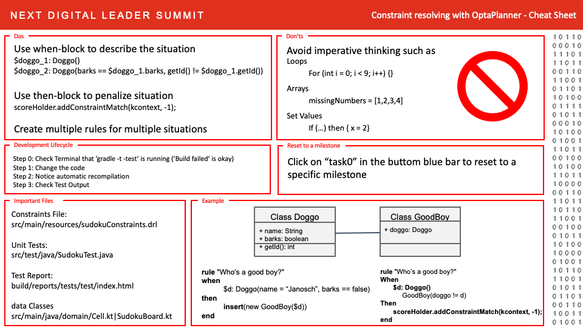

# NEXT DIGITAL LEADER SUMMIT 2020

# Get started
1. You will have to code in this session. We have prepared a running development environment on gitpod.io. Please click on the button to start you own instance.

1. Make yourself familiar with the Editor (It is very similiar to VS Code)

1. Do you find the file of the Sudoku Board implementation?

1. Locate the test report html file [./build/reports/tests/test/classes/SudokuTest.html](./build/reports/tests/test/classes/SudokuTest.html) and open it as preview. (You can right-click on the file in the Explorer and select 'Open with' -> 'preview')

1. What is the output of the Unit Test `task0`?

# First Task

1. You can continue to work on this branch or switch to Branch task1 or open a new instance for a fresh start. 

2. We have prepared a Sudoku Board for you and your task is to fill the board with the number 8. For this you have to create a new Constraint Rule in the file sudokuConstraints.drl. You can test your code with the command gradle -t test.

3. If you completed the task, the unit test named `task1` succeeds.

# Second Task

1. You can continue to work on this branch or switch to Branch task2 or open a new instance for a fresh start. 

2. In this task you will implement two new Constraint Rules. 
One to check that each row in the Sudoku Board is valid, 
that means all numbers 1 - 9 are present, and the second rule is to check each column in the Sudoku Board.
(You will only need to edit sudokuConstraints.drl, but also have a look at Cell.kt)

3. If you completed the task, the unit test named `task2` succeeds.

# Third Task

1. You can continue to work on this branch or switch to Branch task3 or open a new instance for a fresh start. 

2. To get a valid Sudoku one rule is missing, you will implent this rule now. A Sudoku Board has nine 3x3 regions. In each reagion all numbers from 1-9 must be present.
(You will need to edit sudokuConstraints.drl, but also can edit Cell.kt)

3. If you completed the task, the unit test named `task3` succeeds.
